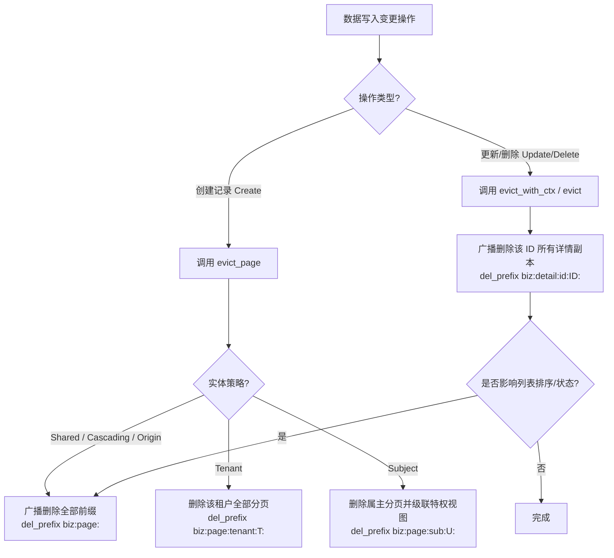

# 缓存一致性与全域广播淘汰架构规范指南 (Cache Consistency & Broadcast Eviction Architecture Guide)

> **适用范围**：所有接入 `pecs-cache` 的微服务、Base-gen 代码生成模板、以及后续维护该系统的架构师与 AI 助手。  
> **编写日期**：2026-09-23  
> **最后修订**：2026-09-23  

---

## 1. 背景与历史教训 (Why This Matters)

### 1.1 真实事故现场

在战报系统上线与测试过程中，前端与网关反馈了如下典型故障：
1. 客户端通过 `POST /battle` 创建了一条新的战报记录。
2. 随后立即请求战报列表 `GET /battle?sort=-created_at,id&page=1&size=10`，**返回的列表依然是旧数据，完全没有包含刚创建的记录**。
3. 更严重的是：**发起请求的客户端 IP 自身刷新页面，依然看到的是旧分页缓存**。
4. 随后推导发现更深层隐患：某条记录被其所有者或管理员修改（`PUT /battle/{id}`）后，其他访客（不同的 IP、不同的登录用户、未登录匿名访客）读取该条记录详情时，**依然命中各自作用域下的旧详情缓存，持续出现数据脏读**。

---

## 2. 根因剖析：旧设计的致命缺陷 (Four Fatal Architectural Flaws)

经过深度排查，旧设计存在 4 处底层架构缺陷，导致缓存系统形同虚设且充满隐蔽脏读：

```
【旧设计缺陷 1：单条 Key 层级倒置，无法批量删除】
   app:battle:detail:{scope}:id:{id}
                      ^^^^^ 前置的作用域阻断了基于 ID 的批量前缀匹配！
   访客 A (IP 1): app:battle:detail:origin:1.1.1.1:id:123
   访客 B (User 2): app:battle:detail:sub:1002:id:123
   作者修改 ID 123 时，执行 del(app:battle:detail:sub:1001:id:123)
   结果：访客 A 和访客 B 的缓存毫发无损！

【旧设计缺陷 2：分页 Key 与淘汰前缀割裂】
   app:battle:page:{scope}:q:{hash}
   创建新记录时，若只清理写操作者当前 scope（如 origin:1.1.1.1 或 sub:1001），
   全网成千上万其他 IP 和访客的 page: 缓存根本不会失效！

【旧设计缺陷 3：实体缓存策略静态标记错误】
   公共战报 BattleBo 误标为 `strategy = Private, ttl = 86400`。
   公共业务数据被错误隔离为私有数据，造成列表与详情生命周期紊乱。

【旧设计缺陷 4：网关基础设施 IP 透传缺失】
   pecs-bff 网关向内部微服务转发请求时未主动注入 `x-real-ip` 与 `x-forwarded-for`，
   导致下游微服务获取客户端 IP 失败，降级为 none/anon，隔离逻辑失效。
```

---

## 3. 核心设计规范与铁律 (Non-Negotiable Architecture Rules)

为了彻底根治上述问题，`pecs-cache` 全面推倒重构，并确立以下**绝不可触犯的硬性铁律**：

### 铁律一：Key 的命名层次规范 (Hierarchical Key Specification)

所有实体缓存 Key 的命名必须严格遵循以下层次结构，**禁止私自倒置参数顺序**：

| 缓存类型 | Key / 前缀规范 | 示例 | 淘汰对应前缀 |
| :--- | :--- | :--- | :--- |
| **单条详情缓存** | `{prefix}{biz}:detail:id:{id}:{scope}` | `app:battle:detail:id:123:shared`<br>`app:battle:detail:id:123:sub:1001`<br>`app:battle:detail:id:123:origin:1.1.1.1` | `{prefix}{biz}:detail:id:{id}:` |
| **单条通用前缀** | `{prefix}{biz}:detail:id:{id}:` | `app:battle:detail:id:123:` | **一条 `del_prefix` 广播淘汰该 ID 在全网的所有 Scope！** |
| **分页列表缓存** | `{prefix}{biz}:page:{scope}:q:{hash}` | `app:battle:page:shared:q:a1b2c3d4`<br>`app:battle:page:origin:1.1.1.1:q:...` | `{prefix}{biz}:page:` 或 `{prefix}{biz}:page:{scope}:` |
| **全业务分页前缀** | `{prefix}{biz}:page:` | `app:battle:page:` | **一条 `del_prefix` 广播淘汰该实体下的所有全量分页！** |

> **关键原则**：  
> **单条详情的 `:id:{id}` 必须在 `{scope}` 之前！**  
> 因为一条数据的 ID 是数据库主键（唯一标识）。无论这条记录被多少个不同的访客、不同的 IP、或者管理员读取过，只要这条记录在持久层被修改或删除，它的**全部历史详情缓存副本就必须作为整体作废**。利用 `{prefix}{biz}:detail:id:{id}:` 前缀，只需一条 Redis/内存前缀扫描删除，即可瞬间全量淘汰，且绝对不会误伤其他 ID（如 `id=124`）！

---

### 铁律二：全域广播淘汰机制 (Broadcast Eviction Mechanism)

当数据发生写入与变更时，必须依据操作性质触发正确的广播淘汰：



#### 1. 创建记录（`Create` / `Insert`）
- **现象**：新记录写入，全表的总记录数、最新排序（如 `sort=-created_at,id`）发生全局质变。
- **规范**：针对 `Shared`、`Cascading`、`Origin` 策略，**必须对 `{prefix}{biz}:page:` 执行全量广播淘汰！**
- **严禁**：严禁只清理当前请求者自身的单点 scope。

#### 2. 更新/删除记录（`Update` / `Delete`）
- **单条详情**：必须调用 `cache.evict_with_ctx::<T>(id, &ctx)`。
  框架内部将直接执行：
  ```rust
  let item_prefix = self.build_item_prefix(T::BIZ, id_str);
  self.store.del_prefix(&item_prefix).await?;
  ```
  **一条指令清空该 ID 在全网所有访客、所有 IP、所有主体及管理员端的全部详情副本！**
- **分页列表**：若更新的字段涉及列表展示或排序（如公开状态、审核状态、更新时间、标题等），必须联动调用 `evict_page`，或者直接调用全量智能淘汰：
  ```rust
  cache.evict_all_smart::<T>(Some(id), &ctx).await?;
  ```

---

### 铁律三：作用域推导归一化 (Scope Normalization for Shared Strategy)

针对标记为 `CacheStrategy::Shared` 的实体：
- **事实**：数据是全网公开共享的（如博客文章、公开战报、系统公告、公共配置）。对于普通用户、未登录访客、还是系统管理员，数据内容完全一致。
- **规范**：在 `resolve_scope` 中，针对 `CacheStrategy::Shared`，除显式覆盖外，**一律直接归一化为 `"shared"`**。
- **严禁**：严禁仅因为管理员携带了 `is_privileged: true` 就将 Shared 实体分裂出独立的 `"privileged"` 详情副本。分裂只会白白消耗内存并产生脏读隐患！

---

### 铁律四：网关（BFF）IP 透传链路保障

全系统的来源隔离（`Origin`）、级联策略（`Cascading`）高度依赖客户端的真实网络来源：
- **规范**：`pecs-bff` 在向任何下游 gRPC / HTTP 微服务分发、转发请求时，**必须在请求头中提取并强行透传 `x-real-ip` 与 `x-forwarded-for`**。
- **代码实施点**：[`pecs-bff/src/api/gateway/dispatcher.rs`](file:///Users/moji/ws/rs/pecs-ws/pecs-bff/src/api/gateway/dispatcher.rs) 中的 `forward_to_url` 方法。

---

## 4. 常见错误与反面教材 (Anti-Patterns to Avoid)

### ❌ 反面教材 1：颠倒 Key 字段顺序
```rust
// 错误！绝对禁止将 scope 放在 id 前面！
format!("{}{}:detail:{}:id:{}", prefix, biz, scope, id)
```
> **后果**：作者修改该 ID 后，无法根据前缀批量清理访客与管理员的详情副本，直接造成严重脏读！

### ❌ 反面教材 2：创建数据时只清空当前上下文的单条 scope
```rust
// 错误！创建数据改变了全表排序，只删当前用户的分页等于没删！
let scope = self.resolve_page_scope::<T>(ctx);
self.store.del_prefix(&format!("{biz}:page:{scope}")).await;
```
> **后果**：发帖/创建战报后，其他人甚至当前 IP 换个无 token 状态访问，看到的全是旧列表！

### ❌ 反面教材 3：业务策略定性错误
```rust
// 错误！将公共广场展示的战报设为 Private 策略！
cache_policy!(BattleBo, biz = "battle", strategy = Private, ttl = 86400);
```
> **规范**：全网所有人均可查看的公开业务，策略必须设为 `Shared`，TTL 建议设为 300 秒以内（高变动业务）。

---

## 5. 测试保障要求 (Verification & Regression Matrix)

任何针对 `pecs-cache` 或各微服务缓存逻辑的修改，必须确保以下自动化集成测试全部 100% 通过：

1. **多 Scope 单条广播淘汰测试**：
   [`pecs-cache/tests/dynamic_test.rs::test_evict_item_broadcast_all_scopes`](file:///Users/moji/ws/rs/pecs-ws/pecs-cache/tests/dynamic_test.rs)
   - 验证读者（User）、匿名客户端（IP）、管理员（Admin）同时缓存某 ID 后，作者更新触发 `evict_with_ctx`，三端全部失效并读取到最新数据，且其他 ID 缓存不被误杀。
2. **多 Scope 分页广播淘汰测试**：
   [`pecs-cache/tests/dynamic_test.rs::test_evict_page_broadcast_all_scopes`](file:///Users/moji/ws/rs/pecs-ws/pecs-cache/tests/dynamic_test.rs)
   - 验证用户、匿名 IP、管理员查列表后，写操作触发 `evict_page`，三端分页全部失效并回源。
3. **全工作区编译**：
   `cargo check --workspace` 零错误。
